**English** | [中文](README.md)

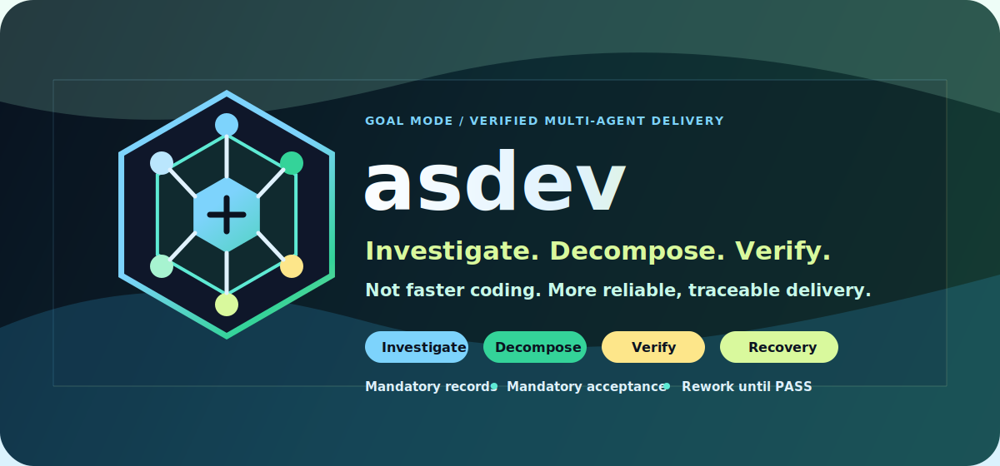


`asdev` is a goal-mode workflow for complex software delivery: investigate real code first, align uncertainty, decompose the work into verifiable tasks, then use independent agents for checks and acceptance. It turns one large risk into smaller risks that can be found, corrected, traced, and accepted.

---

## Why asdev

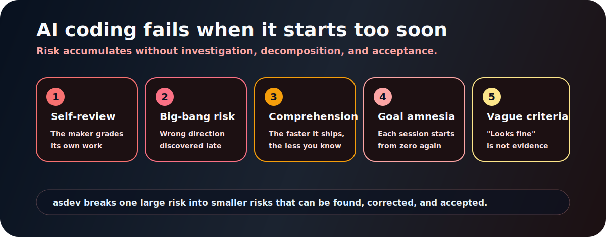

The dangerous part of AI coding is not that the model cannot write code. It is that it often starts writing too soon. Requirements are not investigated, call chains are not confirmed, acceptance criteria are not objective, and the main agent has already entered implementation mode.

asdev follows a simple rule: **understand before design, decompose before implementation, accept before calling it done.**

---

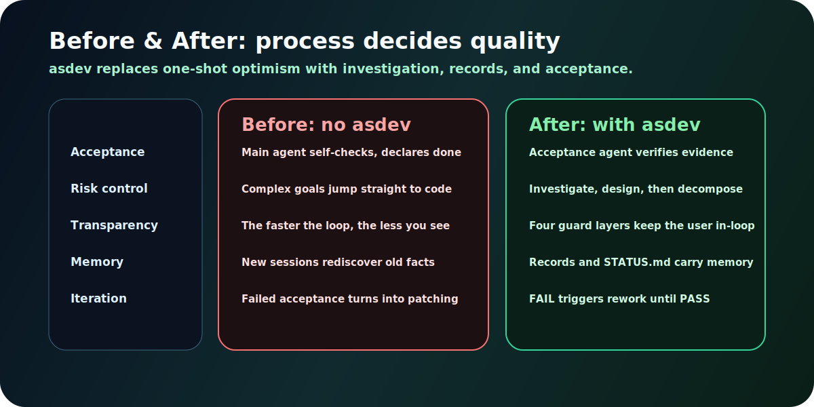

Same requirement, same model. The difference is the process. asdev uses independent investigation, phase checks, task acceptance, and durable records to replace "looks fine" with "passed with evidence".

---

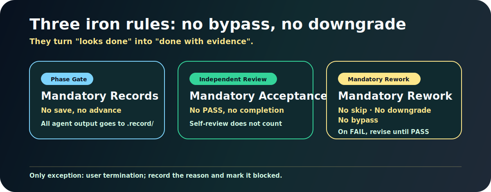

**Iron rule checkpoint**: after each artifact is saved, the main agent must verify that the file exists before moving forward. Failed checkpoint means the step is not complete. The only exception is explicit user termination; then the reason is recorded and the status becomes `Blocked`.

---

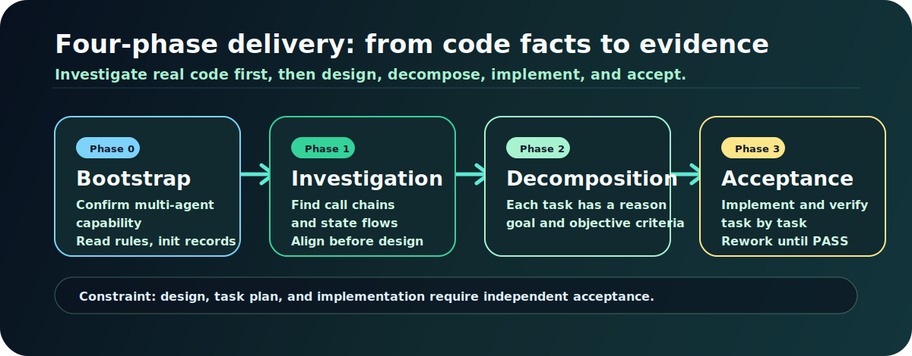

1. **Phase 0 Bootstrap**: confirm multi-agent capability, read project rules, initialize `.record/` and `STATUS.md`.
2. **Phase 1 Investigation**: independent agents inspect code facts, call chains, state flows, data flows, and align uncertainty with the user.
3. **Phase 2 Decomposition**: turn the design into ordered tasks; each task has a reason, goal, and objective acceptance criteria.
4. **Phase 3 Implementation & Acceptance**: implement task by task; independent acceptance verifies each criterion; `FAIL` must be reworked until `PASS`.

---

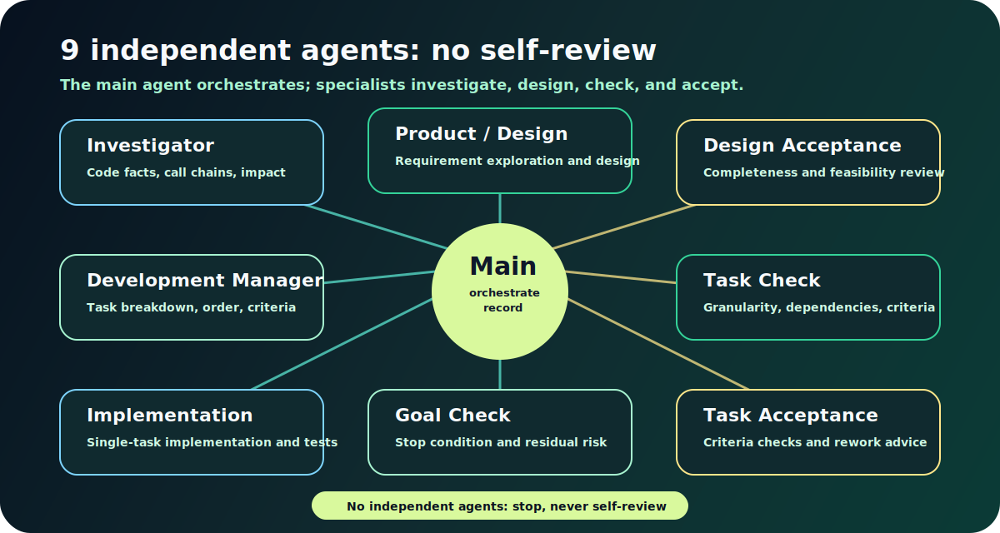

Execution roles handle investigation, design, decomposition, and implementation. Review roles handle design acceptance, task checks, task acceptance, and goal checks. The main agent does not grade its own work; it orchestrates, records, aligns, and drives the loop.

Review roles should use a higher-reasoning model when the platform supports it, reducing shared cognitive bias with execution roles. When per-role model selection is unavailable, asdev falls back to prompt-level reasoning instructions.

---
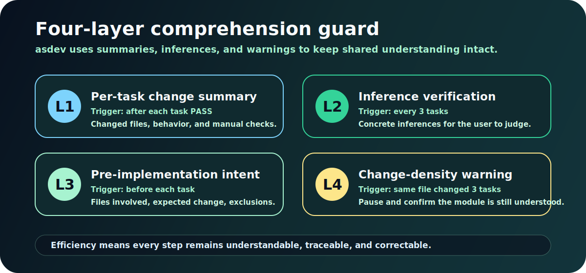

A system that ships code faster than the user can understand it is not efficient. It is erosive. asdev keeps the user in the loop with per-task summaries, inference checks every 3 tasks, pre-implementation intent, and mandatory change-density warnings.

---

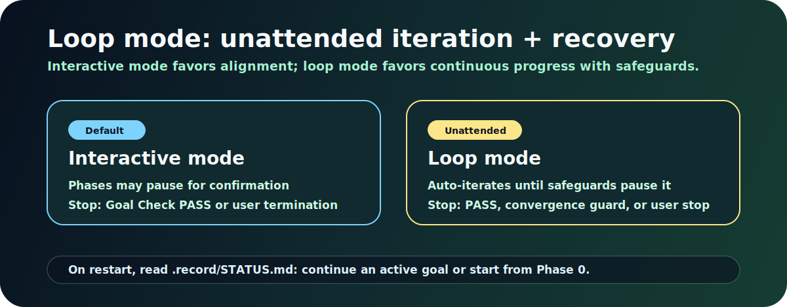

**Breakpoint recovery**: when loop mode starts or restarts, asdev reads `.record/STATUS.md`. If an active goal exists, it continues from the current phase. Otherwise, it starts from Phase 0.

**Scheduling integration**:

```text
Claude Code:  /loop 10m "/asdev [goal with loop-mode keyword]"
Claude Code:  hooks / cron scheduled trigger
Codex:        Automations tab -> project + prompt + cadence
Manual:       /asdev [goal] - STATUS.md preserves continuity
```

A loop that cannot converge is a design problem, not a persistence problem.

---

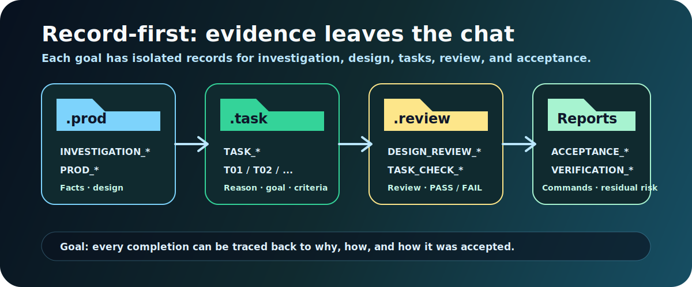

Each goal gets an isolated record directory, so records from different goals never mix:

```text
.record/
├── STATUS.md                  <- aggregated state view, breakpoint recovery foundation
├── .knowledge/                 <- cross-goal shared knowledge items
│   └── KNOW_YYYYMMDD_*.md
├── {goal-slug}/                <- one isolated subdirectory per goal
│   ├── .goal/                  <- goal config and stop condition
│   ├── .prod/                  <- investigation, requirement exploration, design
│   ├── .task/                  <- task decomposition and acceptance criteria
│   └── .review/                <- checks, acceptance, verification reports
└── {another-goal}/             <- another goal, fully isolated
```

`STATUS.md` has three sync layers: `scripts/sync-status.py` can regenerate it from record files; the Claude Code PostToolUse Hook can sync after file changes; agent checkpoints manually update key events. If hooks are unavailable, there is still defense in depth.

Cross-goal memory comes from `STATUS.md` and `.knowledge/`: a new goal reads the aggregated view and project experience before passing historical context to the investigator agent.

---

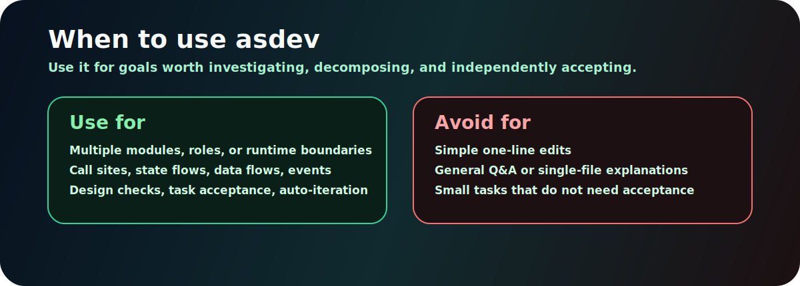

Use asdev for goals that span multiple modules, roles, or runtime boundaries; for work that needs call-site, state-flow, data-flow, or event-flow investigation; and for delivery that needs design checks, task acceptance, or unattended iteration.

Do not use it for simple one-line edits, general Q&A, single-file explanations, or small tasks that do not need an acceptance loop.

---

## Quick Start

**Prerequisites**: Claude Code or Codex environment + support for independent subagents (Agent tool / subagent tools) + Git.

**Install**: give this sentence to your agent:

```text
Install the asdev skill from https://github.com/welsione/asdev into the current environment's skills directory; use ~/.claude/skills/asdev for Claude Code or ~/.codex/skills/asdev for Codex, then remind me to restart or open a new session.
```

**Examples**:

```text
/asdev Handle this goal:
After editing profile on mobile, avatar and nickname occasionally fail to sync to the personal page.
Investigate the frontend state flow, API calls, cache updates, and backend response chain first;
align any uncertain business rules with me, then produce requirement exploration and task decomposition.
```

```text
/asdev loop mode:
Migrate the legacy order status field to the new state machine model while keeping API, background tasks, and reports compatible.
Stop condition: all test/order-related tests pass and lint has no new warnings.
```

---

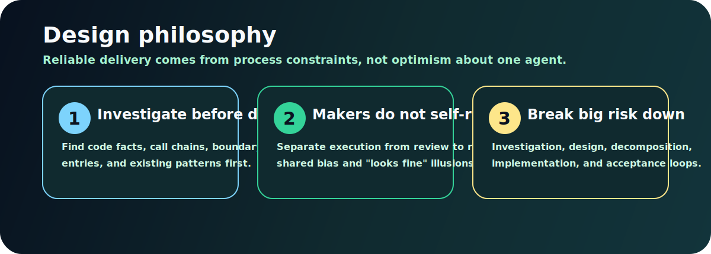

asdev does not make agents start faster. It makes them deliver more reliably.

`Mandatory Recording` · `Mandatory Acceptance` · `Mandatory Rework on Rejection`
