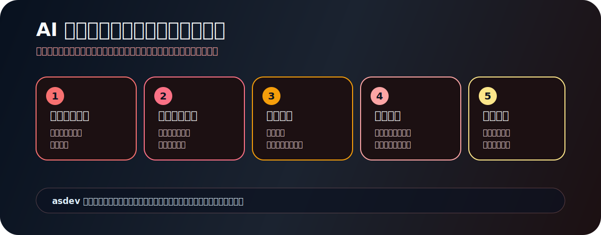
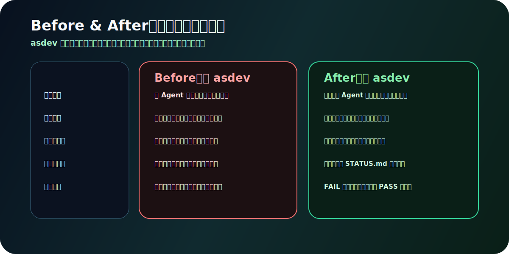
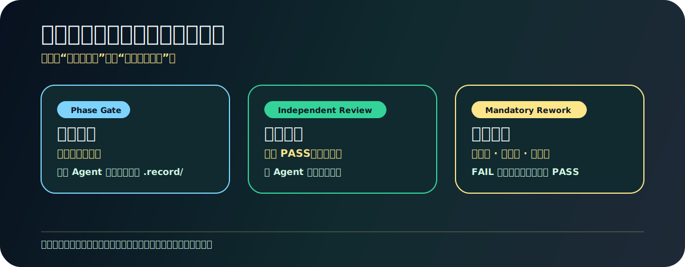
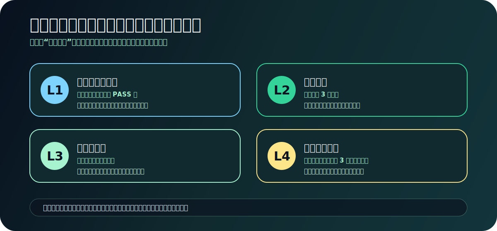
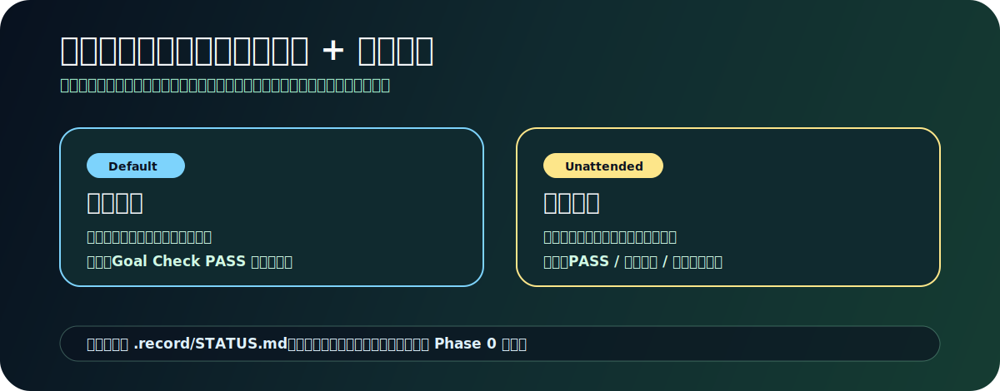
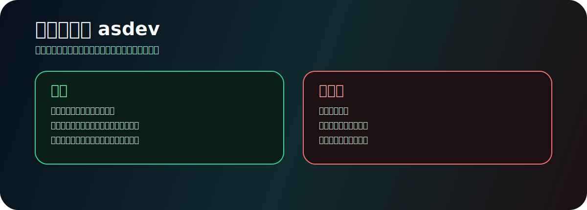
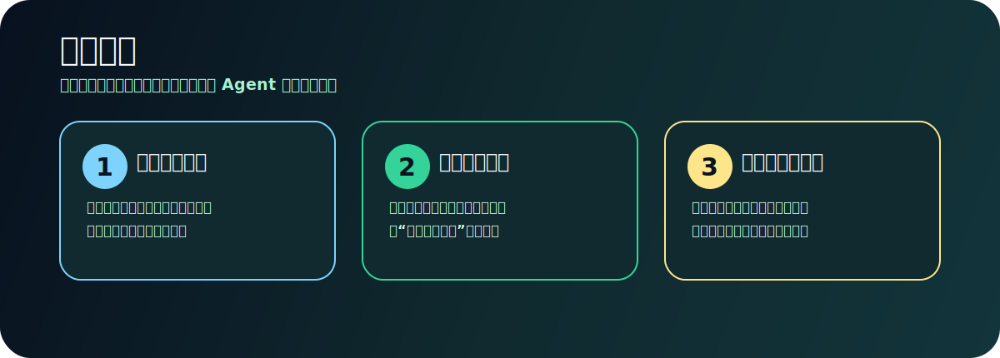

[English](README.en.md) | **中文**


`asdev` 是一个面向复杂软件目标的目标模式工作流：先调查真实代码，再对齐不确定性，再拆成可验收任务，最后用独立 Agent 做检查和验收。它把一次性的大风险拆成多个可发现、可纠正、可追溯的小风险。

---

## 为什么需要 asdev



普通 AI 编程最危险的地方，不是模型不会写代码，而是它太快开始写代码。需求还没有被调查，调用链还没有被确认，验收标准还没有客观化，主 Agent 就已经进入实现循环。

asdev 的核心原则很直接：**先理解，再设计；先拆解，再实现；先验收，再宣布完成。**

---

## Before & After



同样的需求，同样的模型，唯一的区别是流程。asdev 用独立调查、阶段检查、任务验收和记录沉淀，把“看起来没问题”变成“有证据地通过”。

---

## 三条铁律



**铁律执行检查点**：每次产出落盘后，主 Agent 必须验证文件存在才推进下一步。检查点不通过 = 步骤未完成。唯一的例外是用户显式终止任务，此时记录终止原因，状态变为 `阻塞`。

---

## 四阶段交付流


1. **Phase 0 能力探测**：确认多 Agent 能力，读取项目规范，初始化 `.record/` 和 `STATUS.md`。
2. **Phase 1 代码调查**：独立 Agent 查代码事实、调用链、状态流、数据流，并与用户对齐不确定性。
3. **Phase 2 任务拆解**：将设计拆成有序任务，每个任务都有原因、目标和客观验收项。
4. **Phase 3 开发验收**：逐任务实现，独立验收 Agent 逐项验证，`FAIL` 必须返工直到 `PASS`。

---

## 9 个独立 Agent


执行角色负责调查、设计、拆解和实现；审查角色负责设计验收、任务检查、任务验收和目标检查。主 Agent 不给自己的作业打分，只负责编排、记录、对齐和推动闭环。

审查角色推荐使用更高推理模型，进一步减少与执行角色的认知偏差共享。当平台不支持分模型时，回退到 prompt 级推理指令。

---

## 四层理解腐烂防护



一个循环越快产出代码、用户越看不懂的系统，不是高效，是侵蚀。asdev 把用户留在循环里：每个任务有变更摘要，每 3 个任务有推断验证，每个任务实施前说明意图，同一模块连续高密度修改时强制预警。

---

## 循环模式



**断点恢复**：循环模式启动或重启时，读取 `.record/STATUS.md`。如果有活跃目标则从当前阶段继续，否则从 Phase 0 开始。

**调度集成**：

```text
Claude Code:  /loop 10m "/asdev [目标描述 含循环模式关键词]"
Claude Code:  hooks / cron 定时触发
Codex:        Automations tab → 项目 + 提示词 + 频率
手动重触发:   /asdev [目标]，STATUS.md 保证连续性
```

一个无法收敛的循环是设计问题，不是坚持问题。

---

## 记录优先


每个目标拥有独立隔离的记录目录，不同目标的记录永不混淆：

```text
.record/
├── STATUS.md                  ← 聚合状态视图，断点恢复的基石
├── .knowledge/                 ← 跨目标共享知识条目
│   └── KNOW_YYYYMMDD_*.md
├── {goal-slug}/                ← 每个目标独立子目录
│   ├── .goal/                  ← 目标配置与停止条件
│   ├── .prod/                  ← 代码调查、需求探索、方案设计
│   ├── .task/                  ← 任务拆解和验收标准
│   └── .review/                ← 检查、验收、验证报告
└── {another-goal}/             ← 另一个目标，完全隔离
```

`STATUS.md` 有三层同步保障：`scripts/sync-status.py` 从记录文件自动生成；Claude Code PostToolUse Hook 在文件变更后自动同步；Agent 检查点在关键事件手动更新。Hook 不可用时，仍保留防御深度。

跨目标记忆来自 `STATUS.md` 和 `.knowledge/`：新目标启动时先读取聚合视图和项目经验，再把历史上下文传给调查 Agent，避免重复发现已知事实。

---

## 什么时候用 asdev



asdev 适合跨模块、跨角色、跨运行边界的目标；适合需要调查调用链、状态流、数据流、事件流的问题；适合需要先写需求探索、再拆任务、再逐步开发并独立验收的工作。

它不适合简单一行修改、普通问答、单文件解释，或没有必要引入验收闭环的小任务。

---

## 快速开始

**前置条件**：Claude Code 或 Codex 环境 + 环境支持独立子代理（Agent tool / subagent tools）+ Git。

**安装**：把这句话丢给 Agent：

```text
请从 https://github.com/welsione/asdev 安装 asdev skill 到当前环境的 skills 目录；如果是 Claude Code 安装到 ~/.claude/skills/asdev，如果是 Codex 安装到 ~/.codex/skills/asdev，安装完成后提醒我重启或开启新会话。
```

**使用示例**：

```text
/asdev 处理这个目标：
用户在移动端编辑资料后，头像和昵称偶尔不会同步到个人主页。
请先调查前端状态流、接口调用、缓存更新和后端响应链路；
如果有不确定的业务规则先和我对齐，再产出需求探索和任务拆解。
```

```text
/asdev 循环模式：
把旧版订单状态字段迁移到新的状态机模型，同时保持 API、后台任务和报表兼容。
停止条件：所有 test/order 相关测试通过且 lint 无新增警告。
```

---

## 设计哲学



asdev 不是让 Agent 更快动手，而是让 Agent 更可靠地交付。

`强制记录` · `强制验收` · `验收不过必须返工`
