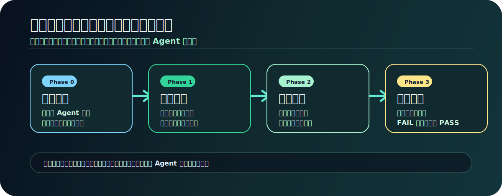
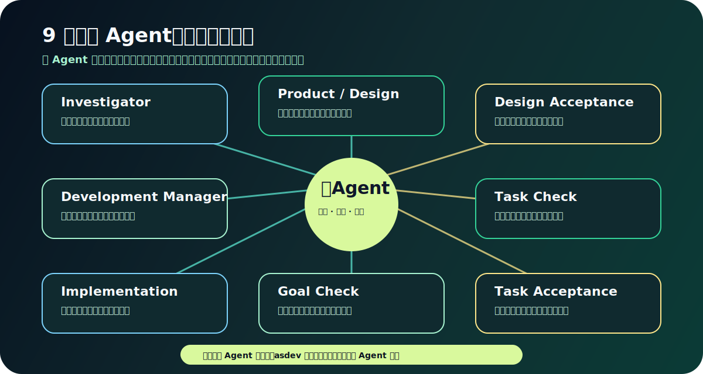
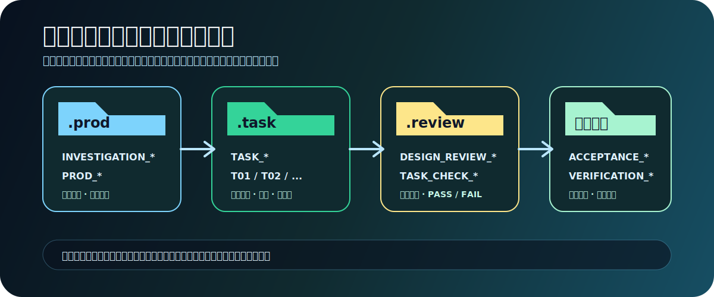

<p align="center">
  
</p>

<p align="center">
  <strong>面向复杂软件目标的强制多 Agent 交付工作流 Skill</strong>
</p>

<p align="center">
  <code>先调查代码</code> · <code>再对齐疑问</code> · <code>再设计拆解</code> · <code>逐任务开发</code> · <code>独立验收闭环</code>
</p>

---

## asdev 是什么？

**asdev** 是一个给 Codex 和 Claude Code 使用的目标模式 Skill。它把复杂开发任务从“一次性改代码”升级为一套可审计、可复盘、可验收的多 Agent 交付流程。

它适合处理这类任务：

- 跨模块重构、架构调整、复杂缺陷修复
- 安全问题、异常传播、接口兼容性验证
- “找到所有直接/间接调用点”这类调用链调查
- 需要先产出需求探索、再拆任务、再逐步开发的目标模式
- 希望引入验收 Agent / 检查 Agent / 多 Agent 校验的工程流程

一句话：**asdev 不是让 Agent 更快动手，而是让 Agent 更可靠地交付。**

<p align="center">
  
</p>

## 核心原则

```text
调查代码事实 -> 对齐不确定性 -> 形成方案 -> 拆解任务 -> 实施开发 -> 独立验收
```

asdev 强制遵守三条硬规则：

1. **代码调查优先**：没有真实代码事实，不写设计。
2. **多 Agent 必须**：没有独立 Agent 能力时，流程停止，不用主 Agent 自审冒充验收。
3. **记录优先**：调查、设计、审查、任务、验收都要落盘到 `.record/`，避免证据只留在聊天上下文里。

## 工作流总览

| 阶段 | 名称 | 目标 | 关键产物 |
| --- | --- | --- | --- |
| Phase 0 | 首次初始化与能力探测 | 确认项目规范、记录目录、多 Agent 能力 | `.record/`、模板、能力说明 |
| Phase 1 | 代码调查与需求探索 | 找出真实调用链、影响范围、疑问点 | `INVESTIGATION_*`、`PROD_*` |
| Phase 2 | 任务拆解与计划检查 | 把方案拆成可验收的任务 | `TASK_*`、`TASK_CHECK_*` |
| Phase 3 | 逐任务开发与验收 | 开发、验证、返工、验收闭环 | `TASK_TXX_ACCEPTANCE_*` |

默认情况下，asdev 会在 **Phase 2 完成后暂停**，询问用户是否继续进入开发阶段。

## 多 Agent 角色

asdev 至少需要这些独立 Agent：

<p align="center">
  
</p>

| Agent | 职责 |
| --- | --- |
| Investigator Agent | 调查代码事实、直接调用点、间接调用链、边界入口 |
| Product/Design Agent | 基于调查结果产出需求探索和方案设计 |
| Design Acceptance Agent | 验收 Phase 1 设计是否完整、可行、可验证 |
| Development Manager Agent | 将设计拆解为有顺序、有验收标准的任务 |
| Task Check Agent | 检查任务粒度、依赖顺序、验收项是否客观 |
| Implementation Agent | 在平台允许时执行单任务开发 |
| Task Acceptance Agent | 按任务验收规范独立检查是否通过 |
| Verification Agent | 对调用链、API、安全、架构等风险做专项验证 |

详细角色提示词见：

- `references/agent-prompts.md`
- `references/prompts/`

## 安装

### Claude Code

将整个目录放到：

```text
~/.claude/skills/asdev
```

当前 Skill 的 frontmatter 标识符是：

```yaml
name: asdev
```

用户可见名称仍然是 **asdev**。安装后建议重启 Claude Code 或开启新会话。

### Codex

将整个目录放到你的 Codex skills 目录，例如：

```text
~/.codex/skills/asdev
```

具体目录以你的 Codex 配置为准。

## 首次使用

在项目中首次运行时，asdev 会尝试创建轻量记录结构：

<p align="center">
  
</p>

```text
.record/
├── .goal/
├── .prod/
├── .task/
└── .review/
```

可能创建的模板：

- `.record/.prod/PROD_TEMPLATE.md`
- `.record/.task/TASK_TEMPLATE.md`
- `.record/.goal/GOAL_CONFIG_TEMPLATE.md`

asdev **不会自动安装外部工具**。`codegraph`、`superpowers`、框架专用 skill 都只是可选增强。

## 使用方式

推荐用 `/asdev` 显式触发：

```text
/asdev 处理这个目标：
用户在移动端编辑资料后，头像和昵称偶尔不会同步到个人主页。
请先调查前端状态流、接口调用、缓存更新和后端响应链路；
如果有不确定的业务规则先和我对齐，再产出需求探索和任务拆解。
```

```text
/asdev 用多 Agent 工作流改造这个桌面端导入流程。
目标是让 CSV / XLSX / JSON 三种文件共用一套校验与错误展示机制。
先调查现有组件、解析逻辑、错误模型和测试覆盖；
Phase 2 完成后先暂停，我确认后再进入开发。
```

```text
/asdev 规划一次数据迁移：
把旧版订单状态字段迁移到新的状态机模型，同时保持 API、后台任务和报表兼容。
请调查调用方、定时任务、数据修复脚本和回滚策略，
再让任务拆解 Agent 给出可逐步上线的任务计划。
```

```text
/asdev 调查这个 CLI 工具的性能问题：
当仓库文件超过 5 万个时，索引命令明显变慢。
请先分析文件扫描、缓存、并发和日志输出路径，
再给出可验证的优化任务，不要直接开始改代码。
```

## 关键文档

| 文件 | 用途 |
| --- | --- |
| `SKILL.md` | Skill 入口、触发条件、总控规则 |
| `references/workflow.md` | Phase 0-3 完整流程 |
| `references/multi-agent-contract.md` | 多 Agent 能力要求与失败处理 |
| `references/recording-protocol.md` | `.record/` 落盘与命名规范 |
| `references/prompt-assembly.md` | Agent prompt 占位符组装协议 |
| `references/agent-prompts.md` | 角色 prompt 索引 |
| `references/prompts/*.md` | 各 Agent 的具体提示词 |
| `references/templates.md` | 项目本地模板 |
| `evals/evals.json` | Skill 冒烟测试用例 |

## 可选增强

- **codegraph**：增强调用链、依赖图、入口点分析。
- **superpowers**：增强计划、反思、review discipline。
- **框架专用 skill**：在实现阶段补充语言/框架细节。

这些能力都不是硬依赖。真正的硬依赖只有一个：**平台必须能启动独立 Agent**。

## 设计取舍

asdev 故意不追求“最快开始写代码”。它更适合高风险、高复杂度、需要可验收证据的工程任务。

如果任务很小，例如单文件改名、简单命令查询、直接解释一段代码，不建议触发 asdev。它的价值在于把复杂目标变成可审计的工程交付链路。

## 测试

冒烟测试用例位于：

```text
evals/evals.json
```

这些 eval 主要检查：

- 是否先确认多 Agent 能力
- 是否先启动代码调查 Agent
- 是否记录直接/间接调用链
- 是否在 Phase 2 后暂停
- 是否不自动安装外部工具

---

<p align="center">
  <strong>asdev</strong><br />
  把复杂软件目标交给一支有边界、有证据、有验收的 Agent 团队。
</p>
